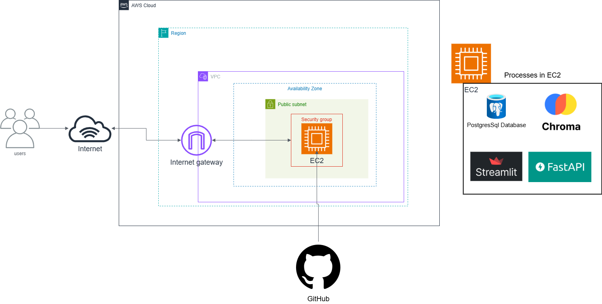

# AWS Infrastructure Deployment for RAG Chatbot using Terraform

This project deploys a Retrieval-Augmented Generation (RAG) Chatbot application on AWS using Terraform for Infrastructure as Code (IaC).

## Project Overview

The chatbot uses:

- **Streamlit** for the user interface

- **FastAPI** for handling backend logic

- **ChromaDB** (Vector Store) for retrieving relevant information from user-uploaded PDFs

- **PostgreSQL** for structured data storage

It enables users to chat normally and upload PDFs to ask questions specifically about the content of the uploaded documents, making the chatbot highly context-aware and document-focused.

## Architecture Overview

The infrastructure includes:
- **VPC** with public subnets across multiple AZs
- **Internet Gateway** for internet connectivity
- **Security Groups** with least privilege access
- **EC2 instance** (t2.large) running Ubuntu 22.04 LTS with monitoring and logging
- **Elastic IP** for static public IP address
- **VPC Flow Logs** for network monitoring
- **CloudWatch monitoring** and logging

### Architecture Diagram



The diagram above illustrates the complete AWS infrastructure architecture deployed by this Terraform project:

**Network Layer:**
- **VPC (Virtual Private Cloud)**: Provides isolated network environment with CIDR block 10.0.0.0/16
- **Public Subnets**: Host the EC2 for the Chatbot app.
- **Internet Gateway**: Enables internet connectivity for resources in public subnets
- **Route Tables**: Direct traffic between subnets and to the internet

**Compute Layer:**
- **EC2 Instance**: Ubuntu 22.04 LTS (t2.large) with pre-installed Miniconda3 and PostgreSQL 16
- **Elastic IP**: Provides static public IP address for consistent external access
- **Security Group**: Configured with minimal access (SSH port 22 and streamlit front end port 8501)

**Application Stack:**
- **Miniconda3**: Python environment for data science and machine learning workloads
- **PostgreSQL 16**: Database server for data persistence and analytics
- **Streamlit**: Ready to deploy on port 8501 for web-based interfaces
- **FastAPI**: for handling backend logic.
- **Chromadb**: for vectorized database and context-aware of the documents.

**Security & Monitoring:**
- **IAM Roles**: Least privilege access for EC2 instances
- **VPC Flow Logs**: Network traffic monitoring and security analysis
- **CloudWatch**: Comprehensive monitoring and logging for operational insights
- **EBS Encryption**: Encrypted storage volumes for data protection

This architecture follows AWS Well-Architected Framework principles, ensuring security, reliability, performance efficiency, cost optimization, and operational excellence.

## Prerequisites

1. **AWS CLI configured** with appropriate credentials
2. **Terraform installed** (version >= 1.0)
3. **AWS Key Pair created** for EC2 access

### Create AWS Key Pair (if not exists)
```bash
aws ec2 create-key-pair --key-name my-key-pair --query 'KeyMaterial' --output text > ~/.ssh/my-key-pair.pem
chmod 400 ~/.ssh/my-key-pair.pem
```

## Quick Start

1. **Clone and navigate to the project directory**
   ```bash
   git clone https://github.com/Mohammed78vr/chatbot-app-in-AWS.git
   cd chatbot-app-in-AWS
   ```

2. **Copy and customize variables**
   ```bash
   cp terraform.tfvars.example terraform.tfvars
   # Edit terraform.tfvars with your values
   ```

3. **Initialize Terraform**
   ```bash
   terraform init
   ```

4. **Plan the deployment**
   ```bash
   terraform plan
   ```

5. **Apply the configuration**
   ```bash
   terraform apply
   ```

6. **Access your instance**
   ```bash
   # SSH access (Ubuntu uses 'ubuntu' user by default)
   ssh -i ~/.ssh/your-key-pair.pem ubuntu@<public-ip>
   ```

7.  **One you are connected to the EC2 instance**
    Create a file named ```setup.sh```. Then, copy and paste the script.
    below. After that, run the scripts. The scripts take 4 arguments:
    - **PAT_token**: Your GitHub personal access token.
    - **repo_url**: The URL of your GitHub repository (without https://).
    - **branch_name**: The branch name to use on the EC2.
    - **password**: The password that will be altred from the postgresSql database.

    > Note: You need to add your OPENAI API KEY in the ```OPENAI_API_KEY``` line.

    ```bash
    #!/bin/bash

    # Check if the correct number of arguments is provided
    if [ $# -ne 4 ]; then
    echo "Usage: $0 <PAT_token> <repo_url> <branch_name> <password>"
    exit 1
    fi

    # Assign arguments to variables
    PAT_TOKEN="$1"
    REPO_URL="$2"
    BRANCH_NAME="$3"
    PASSWORD="$4"
    REPO_NAME=$(basename "$REPO_URL" .git)
    USER=$(whoami)
    HOME_DIR=$(eval echo ~$USER)

    # Set up PostgreSQL database
    echo "Setting up database..."
    sudo -u postgres psql -c "ALTER USER postgres PASSWORD '$PASSWORD'"
    if ! sudo -u postgres psql -lqt | cut -d \| -f 1 | grep -qw project; then
        sudo -u postgres psql -c "CREATE DATABASE project"
    else
        echo "Database 'project' already exists"
    fi
    sudo -u postgres psql -d project -c "CREATE TABLE IF NOT EXISTS advanced_chats (
    id TEXT PRIMARY KEY,
    name TEXT NOT NULL,
    file_path TEXT NOT NULL,
    last_update TIMESTAMP DEFAULT CURRENT_TIMESTAMP,
    pdf_path TEXT,
    pdf_name TEXT,
    pdf_uuid TEXT
    );"

    # Set up Conda environment
    echo "Setting up conda environment..."
    source "$HOME_DIR/miniconda3/etc/profile.d/conda.sh"
    if ! conda env list | grep -q "^project "; then
        conda create -y -n project python=3.11
    fi

    # Clone the repository
    echo "Cloning repository..."
    cd "$HOME_DIR"
    if [ -d "$REPO_NAME" ]; then
        echo "Directory $REPO_NAME already exists. Please remove it or choose a different repository."
        exit 1
    fi
    export GITHUB_TOKEN="$PAT_TOKEN"
    git clone -b "$BRANCH_NAME" "https://${GITHUB_TOKEN}@${REPO_URL}"
    if [ $? -ne 0 ]; then
        echo "Failed to clone repository"
        exit 1
    fi
    cd "$REPO_NAME"

    # Install requirements
    echo "Installing requirements..."
    if [ -f requirements.txt ]; then
        "$HOME_DIR/miniconda3/envs/project/bin/pip" install -r requirements.txt
    else
        echo "No requirements.txt found"
    fi

    sudo -u $USER tee $HOME_DIR/$REPO_NAME/.env <<EOF
    OPENAI_API_KEY=<OPENAI_API_KEY>
    DB_NAME=project
    DB_USER=postgres
    DB_PASSWORD=$PASSWORD
    DB_HOST=localhost
    DB_PORT=5432
    EOF

    # Create systemd services
    echo "Creating systemd services..."
    cat <<EOF | sudo tee /etc/systemd/system/chromadb.service
    [Unit]
    Description=ChromaDB
    After=network.target

    [Service]
    Type=simple
    User=$USER
    WorkingDirectory=$HOME_DIR/$REPO_NAME
    ExecStart=$HOME_DIR/miniconda3/envs/project/bin/chroma run --path $HOME_DIR/$REPO_NAME/chroma_db
    Restart=always

    [Install]
    WantedBy=multi-user.target
    EOF

    cat <<EOF | sudo tee /etc/systemd/system/backend.service
    [Unit]
    Description=backend
    After=network.target

    [Service]
    Type=simple
    User=$USER
    WorkingDirectory=$HOME_DIR/$REPO_NAME
    ExecStart=$HOME_DIR/miniconda3/envs/project/bin/uvicorn backend:app --reload --port 5000
    Restart=always

    [Install]
    WantedBy=multi-user.target
    EOF

    cat <<EOF | sudo tee /etc/systemd/system/frontend.service
    [Unit]
    Description=Streamlit
    After=network.target

    [Service]
    Type=simple
    User=$USER
    WorkingDirectory=$HOME_DIR/$REPO_NAME
    ExecStart=$HOME_DIR/miniconda3/envs/project/bin/streamlit run chatbot.py
    Restart=always

    [Install]
    WantedBy=multi-user.target
    EOF

    # Reload systemd and start services
    echo "Reloading systemd and starting services..."
    sudo systemctl daemon-reload
    for service in chromadb backend frontend; do
        sudo systemctl enable $service
        sudo systemctl start $service
    done
    ```

8.  **Check if the chromadb service is running**

    ```bash
    sudo systemctl status chromadb.service
    ```

9. **Verify if the frontend and backend services are running**:

    ```bash
    sudo systemctl status backend.service
    ```
    ```bash
    sudo systemctl status frontend.service
    ```
10. **Access the Webapp using the public IP address**
    use the external or public IP Address with the port 8501 to access the application
    ```bash
    External URL: http://<public_ip>:8501
    ```

## Configuration

### Required Variables
- `key_pair_name`: Your AWS key pair name
- `aws_region`: AWS region for deployment

### Optional Variables
- `project_name`: Project name (default: "terraform-aws-project")
- `environment`: Environment name (default: "dev")
- `instance_type`: EC2 instance type (default: "t2.large")
- `vpc_cidr`: VPC CIDR block (default: "10.0.0.0/16")

## Module Structure

```
modules/
├── vpc/           # VPC, subnets, IGW, routing
├── security/      # Security groups
└── ec2/           # EC2 instances, IAM roles
```

## Security Considerations

1. **SSH Access**: Consider restricting SSH access to specific IP ranges
2. **Key Management**: Store private keys securely
3. **Regular Updates**: Keep AMIs and packages updated
4. **Monitoring**: Review CloudWatch logs and VPC Flow Logs regularly

## Monitoring and Logging

- **CloudWatch Metrics**: CPU, memory, disk usage
- **CloudWatch Logs**: System logs and application logs
- **VPC Flow Logs**: Network traffic monitoring

## Cleanup

To destroy all resources:
```bash
terraform destroy
```