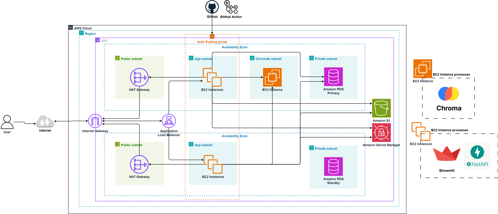

# AWS Infrastructure Deployment for RAG Chatbot using Terraform

This project deploys a Retrieval-Augmented Generation (RAG) Chatbot application on AWS using Terraform for Infrastructure as Code (IaC).

## Table of Contents
- [Project Overview](#project-overview)
- [Project Structure](#project-structure)
- [Architecture Overview](#architecture-overview)
- [Prerequisites](#prerequisites)
- [Configuration](#configuration)
- [Quick Start](#quick-start)
- [Application Setup Script](#application-setup-script)
- [Environment Variables Setup](#environment-variables-setup)
- [Post-Deployment Verification](#post-deployment-verification)
- [GitHub Actions CI/CD Integration](#github-actions-cicd-integration)
- [Cleanup](#cleanup)

## Project Overview

The chatbot uses:

- **Streamlit** for the user interface

- **FastAPI** for handling backend logic

- **ChromaDB** (Vector Store) for retrieving relevant information from user-uploaded PDFs

- **PostgreSQL** for structured data storage

It enables users to chat normally and upload PDFs to ask questions specifically about the content of the uploaded documents, making the chatbot highly context-aware and document-focused.

## Project Structure

```
├── .github/
│   └── workflows/
│       └── deploy.yml           # GitHub Actions CI/CD pipeline
├── Terraform/                   # Terraform infrastructure code
│   ├── modules/
│   │   ├── vpc/                 # VPC, subnets, IGW, NAT Gateway, routing
│   │   ├── ec2/                 # EC2 instance for ChromaDB
│   │   ├── asg/                 # Auto Scaling Group for frontend/backend
│   │   ├── alb/                 # Application Load Balancer
│   │   ├── rds/                 # RDS PostgreSQL database
│   │   ├── s3/                  # S3 bucket for storage
│   │   ├── iam/                 # IAM roles and policies
│   │   └── secrets-manager/     # AWS Secrets Manager for configuration
│   ├── main.tf                  # Main Terraform configuration
│   ├── variables.tf             # Variable definitions
│   ├── outputs.tf               # Output definitions
│   └── terraform.tfvars.example # Example variables file
├── imgs/
│   └── stage-4.drawio.png       # Architecture diagram
├── update_app.sh                # Application update script for CI/CD
├── .gitignore                   # Git ignore file
├── LICENSE                      # Project license
├── README.md                    # Project documentation
├── backend.py                   # FastAPI backend application
├── chatbot.py                   # Streamlit frontend application
└── requirements.txt             # Python dependencies
```

## Architecture Overview

The infrastructure includes:
- **VPC** with public and private subnets across multiple availability zones
- **Internet Gateway** and **NAT Gateway** for internet connectivity
- **Security Groups** with least privilege access
- **EC2 instance** in private subnet dedicated to running ChromaDB
- **Auto Scaling Group** in private subnets for frontend (Streamlit) and backend (FastAPI)
- **Application Load Balancer** in public subnets for internet-facing access
- **RDS PostgreSQL** database in private subnet
- **S3 bucket** for storing chat history and PDF files
- **AWS Secrets Manager** for centralized configuration management
- **IAM roles** with permissions for S3, RDS, Secrets Manager, and SSM access
- **GitHub Actions** integration for automated CI/CD deployment

### Architecture Diagram



The diagram above illustrates the complete AWS infrastructure architecture deployed by this Terraform project:

**Network Layer:**
- **VPC (Virtual Private Cloud)**: Provides isolated network environment with CIDR block 10.0.0.0/16
- **Public Subnets**: Host the Application Load Balancer across multiple availability zones
- **Private Subnets**: Host the Auto Scaling Group, ChromaDB instance, and RDS database
- **Internet Gateway**: Enables internet connectivity for resources in public subnets
- **NAT Gateway**: Enables outbound internet connectivity for resources in private subnets
- **Route Tables**: Direct traffic between subnets and to the internet

**Compute Layer:**
- **Auto Scaling Group**: Hosts frontend (Streamlit) and backend (FastAPI) applications
- **EC2 Instance for ChromaDB**: Dedicated instance in private subnet for vector database
- **Application Load Balancer**: Routes external traffic to the Auto Scaling Group
- **Security Groups**: Configured with minimal access between components

**Database Layer:**
- **Amazon RDS PostgreSQL**: Managed database service in private subnet for secure data storage
- **Database Security Group**: Restricts access to only the ASG instances

**Storage Layer:**
- **Amazon S3**: Object storage for chat history and uploaded PDF files
- **S3 IAM Roles**: Secure access from EC2 to S3 bucket

**Security & Configuration Management:**
- **AWS Secrets Manager**: Centralized secret management for database credentials, API keys, and configuration
- **IAM Roles**: Least privilege access for EC2 to access S3, RDS, Secrets Manager, and SSM
- **EBS Encryption**: Encrypted storage volumes for data protection
- **Network Isolation**: Components isolated in private subnets with no direct internet access

**Application Stack:**
- **Miniconda3**: Python environment for data science and machine learning workloads
- **Streamlit**: Web-based user interface running on port 8501
- **FastAPI**: Backend API for handling application logic on port 5000
- **ChromaDB**: Vector database for document embeddings and similarity search

**DevOps & Automation:**
- **GitHub Actions**: Automated CI/CD pipeline for application deployment and updates
- **AWS Systems Manager (SSM)**: Remote management and automation capabilities
- **Terraform**: Infrastructure as Code for consistent and repeatable deployments

This architecture follows AWS Well-Architected Framework principles, ensuring security, reliability, performance efficiency, cost optimization, and operational excellence. The integration of AWS Secrets Manager provides centralized configuration management, while GitHub Actions enables automated deployment workflows.

## Prerequisites

1. **AWS CLI configured** with appropriate credentials
2. **Terraform installed** (version >= 1.0)
3. **AWS Key Pair created** for EC2 access

### Create AWS Key Pair (if not exists)
```bash
aws ec2 create-key-pair --key-name my-key-pair --query 'KeyMaterial' --output text > ~/.ssh/my-key-pair.pem
chmod 400 ~/.ssh/my-key-pair.pem
```

## Configuration

### Required Variables
Before deploying the infrastructure, you need to configure the following required variables in your `terraform.tfvars` file:

- `key_name`: Your AWS key pair name for EC2 access
- `s3_bucket_name`: Unique name for the S3 bucket (must be globally unique)
- `db_password`: Password for the RDS PostgreSQL database

### Optional Variables
The following variables have default values but can be customized:

- `project_name`: Project name (default: "chatbot")
- `environment`: Environment name (default: "dev")
- `aws_region`: AWS region for deployment (default: "us-east-1")
- `chromadb_instance_type`: EC2 instance type for ChromaDB (default: "t2.large")
- `app_instance_type`: EC2 instance type for ASG instances (default: "t2.large")
- `vpc_cidr`: VPC CIDR block (default: "10.0.0.0/16")
- `public_subnet_cidr`: First public subnet CIDR (default: "10.0.1.0/24")
- `public_subnet_2_cidr`: Second public subnet CIDR (default: "10.0.6.0/24")
- `private_subnet_cidr`: First private subnet CIDR for ChromaDB (default: "10.0.2.0/24")
- `private_subnet_2_cidr`: Second private subnet CIDR for RDS (default: "10.0.3.0/24")
- `private_subnet_3_cidr`: Third private subnet CIDR for ASG (default: "10.0.4.0/24")
- `private_subnet_4_cidr`: Fourth private subnet CIDR for ASG (default: "10.0.5.0/24")
- `db_name`: Database name (default: "chatbotdb")
- `db_username`: Database username (default: "dbadmin")
- `asg_min_size`: Minimum size of the Auto Scaling Group (default: 1)
- `asg_max_size`: Maximum size of the Auto Scaling Group (default: 3)
- `asg_desired_capacity`: Desired capacity of the Auto Scaling Group (default: 2)

### Example terraform.tfvars
```hcl
# Required variables
key_name        = "my-key-pair"
s3_bucket_name  = "my-unique-chatbot-bucket-12345"
db_password     = "your-secure-password"

# Network configuration
# vpc_cidr             = "10.0.0.0/16"
# public_subnet_cidr   = "10.0.1.0/24"  # Public subnet in AZ1 (for ALB)
# public_subnet_2_cidr = "10.0.6.0/24"  # Public subnet in AZ2 (for ALB)
# private_subnet_cidr  = "10.0.2.0/24"  # ChromaDB subnet
# private_subnet_2_cidr = "10.0.3.0/24" # RDS subnet
# private_subnet_3_cidr = "10.0.4.0/24" # ASG subnet (AZ1)
# private_subnet_4_cidr = "10.0.5.0/24" # ASG subnet (AZ2)

# Instance types
# chromadb_instance_type = "t3.large"
# app_instance_type      = "t3.medium"

# Project metadata
# project_name    = "my-chatbot"
# environment     = "production"
# aws_region      = "us-west-2"

# Database configuration
# db_name         = "chatbotdb"
# db_username     = "dbadmin"

# Secrets and API keys
# secret_name     = "my-chatbot-secrets"
# openai_api_key  = "placeholder-openai-key"  # Will be updated manually in AWS Secrets Manager

# ChromaDB configuration
# chromadb_port   = "8000"

# Auto Scaling Group configuration
# custom_ami_id        = ""  # Provide your custom AMI ID if you have one
# asg_min_size         = 1
# asg_max_size         = 3
# asg_desired_capacity = 2
```

## Quick Start

### Infrastructure Deployment

1. **Clone and navigate to the project directory**
   ```bash
   git clone https://github.com/Mohammed78vr/chatbot-app-in-AWS.git
   cd chatbot-app-in-AWS
   ```

2. **Copy and customize variables**
   ```bash
   cp terraform.tfvars.example terraform.tfvars
   # Edit terraform.tfvars with your values
   ```

3. **Initialize Terraform**
   ```bash
   terraform init
   ```

4. **Plan the deployment**
   ```bash
   terraform plan
   ```

5. **Apply the configuration**
   ```bash
   terraform apply
   ```

6. **Access your application**
   ```bash
   # The application is accessible via the ALB DNS name
   echo "Application URL: http://$(terraform output -raw alb_dns_name)"
   ```

### Application Setup

7. **Once the infrastructure is deployed**
   
   The Auto Scaling Group will automatically set up the application using the user data script. You can monitor the deployment by checking the ASG instances and their logs.

## Environment Variables Setup

8. **Update OpenAI API Key in AWS Secrets Manager**
   
   The infrastructure automatically creates an AWS Secrets Manager secret with all required configuration values. However, you need to manually update the OpenAI API key:
   
   ```bash
   # Using AWS CLI to update the OpenAI API key
   aws secretsmanager update-secret --secret-id chatbot-secrets \
     --secret-string '{
       "PROJ-DB-NAME": "your_database_name",
       "PROJ-DB-USER": "your_database_username", 
       "PROJ-DB-PASSWORD": "your_database_password",
       "PROJ-DB-HOST": "your_database_host",
       "PROJ-DB-PORT": "5432",
       "PROJ-OPENAI-API-KEY": "your_actual_openai_api_key_here",
       "PROJ-S3-BUCKET-NAME": "your_s3_bucket_name",
       "PROJ-CHROMADB-HOST": "your_chromadb_private_ip",
       "PROJ-CHROMADB-PORT": "8000"
     }'
   ```
   
   Alternatively, you can update it through the AWS Console:
   1. Go to AWS Secrets Manager in the AWS Console
   2. Find the secret named `chatbot-secrets` (or your custom secret name)
   3. Click "Retrieve secret value"
   4. Click "Edit"
   5. Update the `PROJ-OPENAI-API-KEY` value with your actual OpenAI API key
   6. Save the changes

   **Note**: The application now reads all configuration from AWS Secrets Manager instead of environment variables. The EC2 instances only need two environment variables:
   - `SECRET_NAME`: The name of the AWS Secrets Manager secret (automatically set)
   - `REGION_NAME`: The AWS region (automatically set)

## Post-Deployment Verification

After deployment, verify that all components are running properly:

1. **Check the Auto Scaling Group instances**
   ```bash
   aws ec2 describe-instances --filters "Name=tag:aws:autoscaling:groupName,Values=$(terraform output -raw asg_name)" --query "Reservations[*].Instances[*].[InstanceId, State.Name, PrivateIpAddress]" --output table
   ```

2. **Check the Application Load Balancer health**
   ```bash
   aws elbv2 describe-target-health --target-group-arn $(terraform output -raw target_group_arn) --output table
   ```

3. **Access the web application**
   
   Use the ALB DNS name to access the application:
   ```bash
   echo "Application URL: http://$(terraform output -raw alb_dns_name)"
   ```

## GitHub Actions CI/CD Integration

This project includes GitHub Actions integration for automated deployment and application management. The CI/CD pipeline automatically deploys updates when code is pushed to the configured branch.

### Pipeline Overview:
The workflow (`deploy.yml`) performs the following steps:
1. **Code Checkout**: Retrieves the latest code from the repository
2. **Python Environment Setup**: Sets up Python 3.11 with pip caching
3. **Dependency Installation**: Installs requirements from `requirements.txt`
4. **Testing**: Runs application tests (placeholder for actual tests)
5. **AWS Configuration**: Configures AWS credentials for deployment
6. **ASG Deployment**: Uses AWS SSM to execute the update script on the target ASG instances

### Deployment Process:
The deployment uses AWS Systems Manager (SSM) to remotely execute the update script on your ASG instances, which:
- Fetches the latest code from the configured branch
- Performs a hard reset to ensure clean deployment
- Updates Python dependencies using the conda environment
- Restarts backend and frontend services
- Performs basic health checks on the services

### Prerequisites for GitHub Actions:
1. **AWS Credentials**: Configure AWS access keys in GitHub repository secrets
2. **EC2 SSM Access**: Ensure EC2 instances have proper IAM roles for SSM access (automatically configured by Terraform)
3. **Repository Secrets**: Set up required secrets in your GitHub repository
4. **Branch Configuration**: Update the workflow file to target your desired branch

### Required GitHub Secrets:
```
AWS_ACCESS_KEY_ID          # AWS access key for GitHub Actions
AWS_SECRET_ACCESS_KEY      # AWS secret key for GitHub Actions  
AWS_REGION                 # AWS region (e.g., us-east-1)
ASG_NAME                   # Auto Scaling Group for deployment target
TOKEN                      # GitHub Personal Access Token for repository access
```

### Workflow Configuration:
To change the target branch for deployment, update the `deploy.yml` file:
```yaml
on:
  push:
    branches:
      - your-branch-name  # Change this to your desired branch
```

### Workflow Trigger:
The CI/CD pipeline is automatically triggered when:
- **Push to configured branch**: Automatic deployment to the ASG instances
- The workflow includes basic testing and dependency management
- Failed deployments will show in the GitHub Actions tab for troubleshooting

### Service Management:
The deployment script automatically:
- Updates application code to the latest version
- Installs/updates Python dependencies
- Restarts the `backend` service (FastAPI on port 5000)
- Restarts the `frontend` service (Streamlit on port 8501)
- Provides basic health check feedback

### Monitoring Deployment:
- Check GitHub Actions tab for deployment status
- Monitor EC2 instance logs through CloudWatch or SSM Session Manager
- Verify services are running through SSM commands

This automation ensures consistent deployments and reduces manual intervention while maintaining application availability.

## Cleanup

To destroy all resources:
```bash
terraform destroy
```
