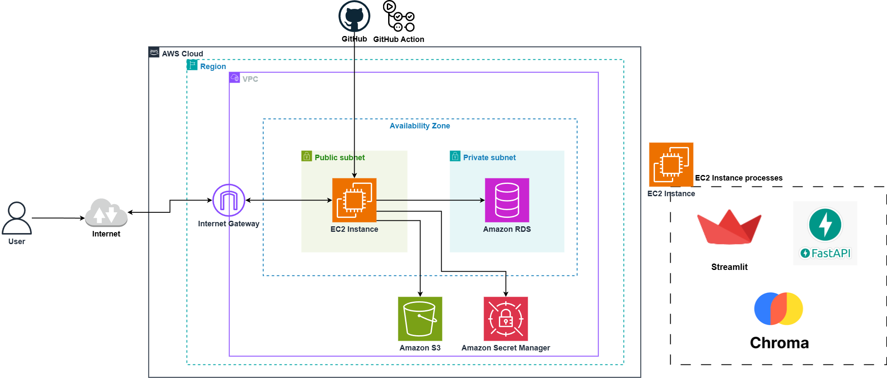

# AWS Infrastructure Deployment for RAG Chatbot using Terraform

This project deploys a Retrieval-Augmented Generation (RAG) Chatbot application on AWS using Terraform for Infrastructure as Code (IaC).

## Table of Contents
- [Project Overview](#project-overview)
- [Project Structure](#project-structure)
- [Architecture Overview](#architecture-overview)
- [Prerequisites](#prerequisites)
- [Configuration](#configuration)
- [Quick Start](#quick-start)
- [Application Setup Script](#application-setup-script)
- [Environment Variables Setup](#environment-variables-setup)
- [Post-Deployment Verification](#post-deployment-verification)
- [GitHub Actions CI/CD Integration](#github-actions-cicd-integration)
- [Cleanup](#cleanup)

## Project Overview

The chatbot uses:

- **Streamlit** for the user interface

- **FastAPI** for handling backend logic

- **ChromaDB** (Vector Store) for retrieving relevant information from user-uploaded PDFs

- **PostgreSQL** for structured data storage

It enables users to chat normally and upload PDFs to ask questions specifically about the content of the uploaded documents, making the chatbot highly context-aware and document-focused.

## Project Structure

```
├── .github/
│   └── workflows/
│       └── deploy.yml           # GitHub Actions CI/CD pipeline
├── Terraform/                   # Terraform infrastructure code
│   ├── modules/
│   │   ├── vpc/                 # VPC, subnets, IGW, routing
│   │   ├── ec2/                 # EC2 instances, IAM roles
│   │   ├── rds/                 # RDS PostgreSQL database
│   │   ├── s3/                  # S3 bucket for storage
│   │   ├── iam/                 # IAM roles and policies
│   │   └── secrets-manager/     # AWS Secrets Manager for configuration
│   ├── main.tf                  # Main Terraform configuration
│   ├── variables.tf             # Variable definitions
│   ├── outputs.tf               # Output definitions
│   └── terraform.tfvars.example # Example variables file
├── imgs/
│   └── stage-3.png              # Architecture diagram
├── update_app.sh                # Application update script for CI/CD
├── .gitignore                   # Git ignore file
├── LICENSE                      # Project license
├── README.md                    # Project documentation
├── backend.py                   # FastAPI backend application
├── chatbot.py                   # Streamlit frontend application
└── requirements.txt             # Python dependencies
```

## Architecture Overview

The infrastructure includes:
- **VPC** with public and private subnets
- **Internet Gateway** for internet connectivity
- **Security Groups** with least privilege access
- **EC2 instance** (t2.large) running Ubuntu 22.04 LTS
- **RDS PostgreSQL** database in private subnet
- **S3 bucket** for storing chat history and PDF files
- **AWS Secrets Manager** for centralized configuration management
- **IAM roles** with permissions for S3, RDS, Secrets Manager, and SSM access
- **GitHub Actions** integration for automated CI/CD deployment

### Architecture Diagram



The diagram above illustrates the complete AWS infrastructure architecture deployed by this Terraform project:

**Network Layer:**
- **VPC (Virtual Private Cloud)**: Provides isolated network environment with CIDR block 10.0.0.0/16
- **Public Subnet**: Hosts the EC2 instance for the Chatbot application with internet access
- **Private Subnet**: Hosts the RDS PostgreSQL database for enhanced security
- **Internet Gateway**: Enables internet connectivity for resources in public subnet
- **Route Tables**: Direct traffic between subnets and to the internet

**Compute Layer:**
- **EC2 Instance**: Ubuntu 22.04 LTS (t2.large) with pre-installed Miniconda3
- **Elastic IP**: Provides static public IP address for consistent external access
- **Security Groups**: Configured with minimal access (SSH port 22, Streamlit port 8501, and database connectivity)

**Database Layer:**
- **Amazon RDS PostgreSQL**: Managed database service in private subnet for secure data storage
- **Database Security Group**: Restricts access to only the EC2 instance

**Storage Layer:**
- **Amazon S3**: Object storage for chat history and uploaded PDF files
- **S3 IAM Roles**: Secure access from EC2 to S3 bucket

**Security & Configuration Management:**
- **AWS Secrets Manager**: Centralized secret management for database credentials, API keys, and configuration
- **IAM Roles**: Least privilege access for EC2 to access S3, RDS, Secrets Manager, and SSM
- **EBS Encryption**: Encrypted storage volumes for data protection
- **Network Isolation**: Database isolated in private subnet with no direct internet access

**Application Stack:**
- **Miniconda3**: Python environment for data science and machine learning workloads
- **Streamlit**: Web-based user interface running on port 8501
- **FastAPI**: Backend API for handling application logic on port 5000
- **ChromaDB**: Vector database for document embeddings and similarity search

**DevOps & Automation:**
- **GitHub Actions**: Automated CI/CD pipeline for application deployment and updates
- **AWS Systems Manager (SSM)**: Remote management and automation capabilities
- **Terraform**: Infrastructure as Code for consistent and repeatable deployments

This architecture follows AWS Well-Architected Framework principles, ensuring security, reliability, performance efficiency, cost optimization, and operational excellence. The integration of AWS Secrets Manager provides centralized configuration management, while GitHub Actions enables automated deployment workflows.

## Prerequisites

1. **AWS CLI configured** with appropriate credentials
2. **Terraform installed** (version >= 1.0)
3. **AWS Key Pair created** for EC2 access

### Create AWS Key Pair (if not exists)
```bash
aws ec2 create-key-pair --key-name my-key-pair --query 'KeyMaterial' --output text > ~/.ssh/my-key-pair.pem
chmod 400 ~/.ssh/my-key-pair.pem
```

## Configuration

### Required Variables
Before deploying the infrastructure, you need to configure the following required variables in your `terraform.tfvars` file:

- `key_name`: Your AWS key pair name for EC2 access
- `s3_bucket_name`: Unique name for the S3 bucket (must be globally unique)
- `db_password`: Password for the RDS PostgreSQL database

### Optional Variables
The following variables have default values but can be customized:

- `project_name`: Project name (default: "chatbot")
- `environment`: Environment name (default: "dev")
- `aws_region`: AWS region for deployment (default: "us-east-1")
- `instance_type`: EC2 instance type (default: "t2.large")
- `vpc_cidr`: VPC CIDR block (default: "10.0.0.0/16")
- `public_subnet_cidr`: Public subnet CIDR (default: "10.0.1.0/24")
- `private_subnet_cidr`: First private subnet CIDR (default: "10.0.2.0/24")
- `private_subnet_2_cidr`: Second private subnet CIDR (default: "10.0.3.0/24")
- `db_name`: Database name (default: "chatbotdb")
- `db_username`: Database username (default: "dbadmin")

### Example terraform.tfvars
```hcl
# Required variables
key_name        = "my-key-pair"
s3_bucket_name  = "my-unique-chatbot-bucket-12345"
db_password     = "your-secure-password"

# Optional variables (uncomment to override defaults)
# project_name    = "my-chatbot"
# environment     = "production"
# aws_region      = "us-west-2"
# instance_type   = "t3.large"
# secret_name     = "my-chatbot-secrets"
# openai_api_key  = "placeholder-openai-key"  # Will be updated manually in AWS Secrets Manager
# chromadb_host   = "localhost"
# chromadb_port   = "8000"
```

## Quick Start

### Infrastructure Deployment

1. **Clone and navigate to the project directory**
   ```bash
   git clone https://github.com/Mohammed78vr/chatbot-app-in-AWS.git
   cd chatbot-app-in-AWS
   ```

2. **Copy and customize variables**
   ```bash
   cp terraform.tfvars.example terraform.tfvars
   # Edit terraform.tfvars with your values
   ```

3. **Initialize Terraform**
   ```bash
   terraform init
   ```

4. **Plan the deployment**
   ```bash
   terraform plan
   ```

5. **Apply the configuration**
   ```bash
   terraform apply
   ```

6. **Access your instance**
   ```bash
   # SSH access (Ubuntu uses 'ubuntu' user by default)
   ssh -i ~/.ssh/your-key-pair.pem ubuntu@<public-ip>
   ```

### Application Setup

7. **Once you are connected to the EC2 instance**
   
   Create a file named `setup.sh`, copy the script from the [Application Setup Script](#application-setup-script) section below, and run it with the required arguments:
   
   ```bash
   chmod +x setup.sh
   bash setup.sh <PAT_token> <repo_url> <branch_name> <db_host> <target_db> <db_username> <db_password> <secret_name> <region>
   ```
   
   **Script Arguments:**
   - **PAT_token**: Your GitHub personal access token
   - **repo_url**: The URL of your GitHub repository (without https://)
   - **branch_name**: The branch name to use on the EC2
   - **db_host**: The database host (e.g., [dbteststage6.postgres.database.azure.com](http://dbteststage6.postgres.database.azure.com/)).
   - **target_db**: The name of the database that was created.
   - **db_username**: The username for the database server.
   - **db_password**: The password for the database server.
   - **secret_name**: The name of the AWS Secrets Manager secret.
   - **region**: The AWS region where the secret is stored.


## Application Setup Script

The following script automates the complete application setup on your EC2 instance. Create a file named `setup.sh` and copy this script:

```bash
#!/bin/bash

# Check if the correct number of arguments is provided
if [ $# -ne 9 ]; then
    echo "Usage: $0 <PAT_token> <repo_url> <branch_name> <db_host> <target_db> <db_username> <db_password> <secret_name> <region>"
    exit 1
fi

# Assign arguments to variables
PAT_TOKEN="$1"
REPO_URL="$2"
BRANCH_NAME="$3"
DB_HOST="$4"
TARGET_DB="$5"
DB_USERNAME="$6"
DB_PASSWORD="$7"
SECRET_NAME="$8"
REGION="$9"
REPO_NAME=$(basename "$REPO_URL" .git)
USER=$(whoami)
HOME_DIR=$(eval echo ~$USER)

# Database names
DEFAULT_DB="postgres"

# Set up PostgreSQL database
echo "Setting up database..."

# Step 1: Create the 'TARGET_DB' database
echo "Creating the $TARGET_DB database..."
psql "host=$DB_HOST port=5432 dbname=$DEFAULT_DB user=$DB_USERNAME password=$DB_PASSWORD sslmode=require" \
    -c "CREATE DATABASE $TARGET_DB;" 2>/dev/null || echo "Database '$TARGET_DB' already exists."

# Step 2: Create the 'advanced_chats' table in the 'TARGET_DB' database
echo "Creating the 'advanced_chats' table in the $TARGET_DB database..."
psql "host=$DB_HOST port=5432 dbname=$TARGET_DB user=$DB_USERNAME password=$DB_PASSWORD sslmode=require" \
    -c "CREATE TABLE IF NOT EXISTS advanced_chats (
        id TEXT PRIMARY KEY,
        name TEXT NOT NULL,
        file_path TEXT NOT NULL,
        last_update TIMESTAMP DEFAULT CURRENT_TIMESTAMP,
        pdf_path TEXT,
        pdf_name TEXT,
        pdf_uuid TEXT
    );"

echo "Database and table setup completed successfully."

# Set up Conda environment
echo "Setting up conda environment..."
source "$HOME_DIR/miniconda3/etc/profile.d/conda.sh"
if ! conda env list | grep -q "^project "; then
    conda create -y -n project python=3.11
fi

# Clone the repository
echo "Cloning repository..."
cd "$HOME_DIR"
if [ -d "$REPO_NAME" ]; then
    echo "Directory $REPO_NAME already exists. Please remove it or choose a different repository."
    exit 1
fi
export GITHUB_TOKEN="$PAT_TOKEN"
git clone -b "$BRANCH_NAME" "https://${GITHUB_TOKEN}@${REPO_URL}"
if [ $? -ne 0 ]; then
    echo "Failed to clone repository"
    exit 1
fi
cd "$REPO_NAME"

# Install requirements
echo "Installing requirements..."
if [ -f requirements.txt ]; then
    "$HOME_DIR/miniconda3/envs/project/bin/pip" install -r requirements.txt
else
    echo "No requirements.txt found"
fi

sudo -u $USER tee $HOME_DIR/$REPO_NAME/.env <<EOF
SECRET_NAME=$SECRET_NAME
REGION_NAME=$REGION
EOF

# Create systemd services
echo "Creating systemd services..."
cat <<EOF | sudo tee /etc/systemd/system/chromadb.service
[Unit]
Description=ChromaDB
After=network.target

[Service]
Type=simple
User=$USER
WorkingDirectory=$HOME_DIR/$REPO_NAME
ExecStart=$HOME_DIR/miniconda3/envs/project/bin/chroma run --path $HOME_DIR/$REPO_NAME/chroma_db
Restart=always

[Install]
WantedBy=multi-user.target
EOF

cat <<EOF | sudo tee /etc/systemd/system/backend.service
[Unit]
Description=backend
After=network.target

[Service]
Type=simple
User=$USER
WorkingDirectory=$HOME_DIR/$REPO_NAME
ExecStart=$HOME_DIR/miniconda3/envs/project/bin/uvicorn backend:app --reload --port 5000
Restart=always

[Install]
WantedBy=multi-user.target
EOF

cat <<EOF | sudo tee /etc/systemd/system/frontend.service
[Unit]
Description=Streamlit
After=network.target

[Service]
Type=simple
User=$USER
WorkingDirectory=$HOME_DIR/$REPO_NAME
ExecStart=$HOME_DIR/miniconda3/envs/project/bin/streamlit run chatbot.py
Restart=always

[Install]
WantedBy=multi-user.target
EOF

# Reload systemd and start services
echo "Reloading systemd and starting services..."
sudo systemctl daemon-reload
for service in chromadb backend frontend; do
    sudo systemctl enable $service
    sudo systemctl start $service
done

echo "Setup completed successfully"
```

## Environment Variables Setup

8. **Update OpenAI API Key in AWS Secrets Manager**
   
   The infrastructure automatically creates an AWS Secrets Manager secret with all required configuration values. However, you need to manually update the OpenAI API key:
   
   ```bash
   # Using AWS CLI to update the OpenAI API key
   aws secretsmanager update-secret --secret-id chatbot-secrets \
     --secret-string '{
       "PROJ-DB-NAME": "your_database_name",
       "PROJ-DB-USER": "your_database_username", 
       "PROJ-DB-PASSWORD": "your_database_password",
       "PROJ-DB-HOST": "your_database_host",
       "PROJ-DB-PORT": "5432",
       "PROJ-OPENAI-API-KEY": "your_actual_openai_api_key_here",
       "PROJ-S3-BUCKET-NAME": "your_s3_bucket_name",
       "PROJ-CHROMADB-HOST": "localhost",
       "PROJ-CHROMADB-PORT": "8000"
     }'
   ```
   
   Alternatively, you can update it through the AWS Console:
   1. Go to AWS Secrets Manager in the AWS Console
   2. Find the secret named `chatbot-secrets` (or your custom secret name)
   3. Click "Retrieve secret value"
   4. Click "Edit"
   5. Update the `PROJ-OPENAI-API-KEY` value with your actual OpenAI API key
   6. Save the changes

   **Note**: The application now reads all configuration from AWS Secrets Manager instead of environment variables. The EC2 instance only needs two environment variables:
   - `SECRET_NAME`: The name of the AWS Secrets Manager secret (automatically set)
   - `REGION_NAME`: The AWS region (automatically set)

## Post-Deployment Verification

After running the setup script, verify that all services are running properly:

1. **Check ChromaDB service status**
   ```bash
   sudo systemctl status chromadb.service
   ```

2. **Verify backend service status**
   ```bash
   sudo systemctl status backend.service
   ```

3. **Verify frontend service status**
   ```bash
   sudo systemctl status frontend.service
   ```

4. **Access the web application**
   
   Use the public IP address with port 8501 to access the application:
   ```bash
   External URL: http://<public_ip>:8501
   ```

## GitHub Actions CI/CD Integration

This project includes GitHub Actions integration for automated deployment and application management. The CI/CD pipeline automatically deploys updates when code is pushed to the configured branch (currently set to `stage-3`).

### Pipeline Overview:
The workflow (`deploy.yml`) performs the following steps:
1. **Code Checkout**: Retrieves the latest code from the repository
2. **Python Environment Setup**: Sets up Python 3.11 with pip caching
3. **Dependency Installation**: Installs requirements from `requirements.txt`
4. **Testing**: Runs application tests (placeholder for actual tests)
5. **AWS Configuration**: Configures AWS credentials for deployment
6. **EC2 Deployment**: Uses AWS SSM to execute the update script on the target EC2 instance

### Deployment Process:
The deployment uses AWS Systems Manager (SSM) to remotely execute the `update_app.sh` script on your EC2 instance, which:
- Fetches the latest code from the configured branch
- Performs a hard reset to ensure clean deployment
- Updates Python dependencies using the conda environment
- Restarts backend and frontend services
- Performs basic health checks on the services

### Prerequisites for GitHub Actions:
1. **AWS Credentials**: Configure AWS access keys in GitHub repository secrets
2. **EC2 SSM Access**: Ensure EC2 instance has proper IAM roles for SSM access (automatically configured by Terraform)
3. **Repository Secrets**: Set up required secrets in your GitHub repository
4. **Update Script**: Ensure `update_app.sh` is present in the EC2 instance at `/home/ubuntu/chatbot-app-in-AWS/`
5. **Branch Configuration**: Update the workflow file to target your desired branch

### Required GitHub Secrets:
```
AWS_ACCESS_KEY_ID          # AWS access key for GitHub Actions
AWS_SECRET_ACCESS_KEY      # AWS secret key for GitHub Actions  
AWS_REGION                 # AWS region (e.g., us-east-1)
EC2_INSTANCE_ID            # EC2 instance ID for deployment target
TOKEN                      # GitHub Personal Access Token for repository access
```

### Workflow Configuration:
To change the target branch for deployment, update the `deploy.yml` file:
```yaml
on:
  push:
    branches:
      - your-branch-name  # Change this to your desired branch
```

### Workflow Trigger:
The CI/CD pipeline is automatically triggered when:
- **Push to configured branch**: Automatic deployment to the EC2 instance (default: `stage-3`)
- The workflow includes basic testing and dependency management
- Failed deployments will show in the GitHub Actions tab for troubleshooting

### Service Management:
The deployment script automatically:
- Updates application code to the latest version
- Installs/updates Python dependencies
- Restarts the `backend` service (FastAPI on port 5000)
- Restarts the `frontend` service (Streamlit on port 8501)
- Provides basic health check feedback

### Monitoring Deployment:
- Check GitHub Actions tab for deployment status
- Monitor EC2 instance logs: `sudo journalctl -u backend -f` and `sudo journalctl -u frontend -f`
- Verify services are running: `sudo systemctl status backend frontend`

This automation ensures consistent deployments and reduces manual intervention while maintaining application availability.

## Cleanup

To destroy all resources:
```bash
terraform destroy
```