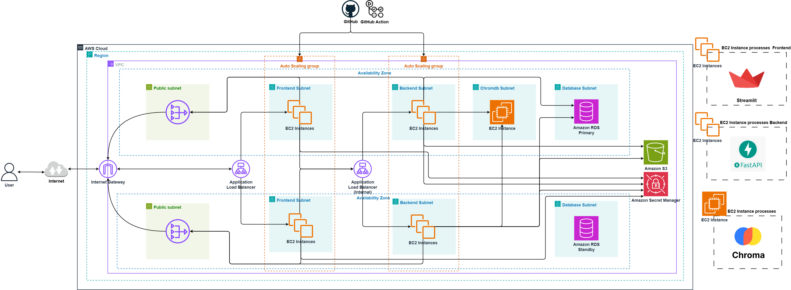

# AWS Infrastructure Deployment for RAG Chatbot using Terraform

This project deploys a Retrieval-Augmented Generation (RAG) Chatbot application on AWS using Terraform for Infrastructure as Code (IaC).

## Table of Contents
- [Project Overview](#project-overview)
- [Project Structure](#project-structure)
- [Architecture Overview](#architecture-overview)
- [Prerequisites](#prerequisites)
- [Configuration](#configuration)
- [Quick Start](#quick-start)
- [Setup Scripts](#setup-scripts)
  - [ChromaDB Instance Setup Script](#chromadb-instance-setup-script)
  - [Frontend ASG Instance Setup Script](#frontend-asg-instance-setup-script)
  - [Backend ASG Instance Setup Script](#backend-asg-instance-setup-script)
- [Creating Custom AMIs](#creating-custom-amis)
  - [Creating ChromaDB AMI](#creating-chromadb-ami)
  - [Creating Frontend ASG AMI](#creating-frontend-asg-ami)
  - [Creating Backend ASG AMI](#creating-backend-asg-ami)
- [Environment Variables Setup](#environment-variables-setup)
- [Post-Deployment Verification](#post-deployment-verification)
- [GitHub Actions CI/CD Integration](#github-actions-cicd-integration)
- [Troubleshooting](#troubleshooting)
- [Cleanup](#cleanup)

## Project Overview

The chatbot uses:

- **Streamlit** for the user interface (frontend)
- **FastAPI** for handling backend logic and API endpoints
- **ChromaDB** (Vector Store) for retrieving relevant information from user-uploaded PDFs
- **PostgreSQL** for structured data storage

This is a microservices architecture where the frontend and backend are deployed separately with their own Auto Scaling Groups and Load Balancers. It enables users to chat normally and upload PDFs to ask questions specifically about the content of the uploaded documents, making the chatbot highly context-aware and document-focused.

## Project Structure

```
├── .github/
│   └── workflows/
│       └── deploy.yml           # GitHub Actions CI/CD pipeline
├── Terraform/                   # Terraform infrastructure code
│   ├── modules/
│   │   ├── vpc/                 # VPC, subnets, IGW, NAT Gateway, routing
│   │   ├── chromadb-ec2/        # EC2 instance for ChromaDB
│   │   ├── frontend-asg/        # Auto Scaling Group for Streamlit frontend
│   │   ├── backend-asg/         # Auto Scaling Group for FastAPI backend
│   │   ├── frontend-alb/        # Internet-facing ALB for frontend
│   │   ├── backend-alb/         # Internal ALB for backend
│   │   ├── rds/                 # RDS PostgreSQL database
│   │   ├── s3/                  # S3 bucket for storage
│   │   ├── iam/                 # IAM roles and policies
│   │   └── secrets-manager/     # AWS Secrets Manager for configuration
│   ├── main.tf                  # Main Terraform configuration
│   ├── variables.tf             # Variable definitions
│   ├── outputs.tf               # Output definitions
│   └── terraform.tfvars.example # Example variables file
├── imgs/
│   └── stage-5.drawio.png       # Architecture diagram
├── update_app.sh                # Application update script for CI/CD
├── .gitignore                   # Git ignore file
├── LICENSE                      # Project license
├── README.md                    # Project documentation
├── backend.py                   # FastAPI backend application
├── chatbot.py                   # Streamlit frontend application
└── requirements.txt             # Python dependencies
```

## Architecture Overview

The infrastructure includes:
- **VPC** with public and private subnets across multiple availability zones
- **Internet Gateway** and **NAT Gateway** for internet connectivity
- **Security Groups** with least privilege access
- **EC2 instance** in private subnet dedicated to running ChromaDB
- **Separate Auto Scaling Groups** for frontend (Streamlit) and backend (FastAPI) in private subnets
- **Internet-facing Application Load Balancer** for frontend access from the internet
- **Internal Application Load Balancer** for backend communication within the VPC
- **RDS PostgreSQL** database in private subnets with multi-AZ deployment
- **S3 bucket** for storing chat history and PDF files
- **AWS Secrets Manager** for centralized configuration management
- **IAM roles** with permissions for S3, RDS, Secrets Manager, and SSM access
- **GitHub Actions** integration for automated CI/CD deployment

### Architecture Diagram



The diagram above illustrates the complete AWS infrastructure architecture deployed by this Terraform project:

**Network Layer:**
- **VPC (Virtual Private Cloud)**: Provides isolated network environment with CIDR block 10.0.0.0/16
- **Public Subnets (10.0.1.0/24, 10.0.2.0/24)**: Host the internet-facing ALB across multiple availability zones
- **Frontend Private Subnets (10.0.3.0/24, 10.0.4.0/24)**: Host the frontend Auto Scaling Group instances
- **Backend Private Subnets (10.0.5.0/24, 10.0.6.0/24)**: Host the backend Auto Scaling Group instances and internal ALB
- **ChromaDB Private Subnet (10.0.7.0/24)**: Hosts the dedicated ChromaDB EC2 instance
- **RDS Private Subnets (10.0.8.0/24, 10.0.9.0/24)**: Host the RDS PostgreSQL database across multiple AZs
- **Internet Gateway**: Enables internet connectivity for resources in public subnets
- **NAT Gateway**: Enables outbound internet connectivity for resources in private subnets
- **Route Tables**: Direct traffic between subnets and to the internet

**Compute Layer:**
- **Frontend Auto Scaling Group**: Hosts Streamlit frontend applications in private subnets
- **Backend Auto Scaling Group**: Hosts FastAPI backend applications in private subnets
- **EC2 Instance for ChromaDB**: Dedicated instance in private subnet for vector database
- **Internet-facing ALB**: Routes external traffic to the frontend ASG
- **Internal ALB**: Routes internal traffic from frontend to backend ASG
- **Security Groups**: Configured with minimal access between components

**Database Layer:**
- **Amazon RDS PostgreSQL**: Managed database service in private subnets with multi-AZ deployment
- **Database Security Group**: Restricts access to only the backend ASG instances

**Storage Layer:**
- **Amazon S3**: Object storage for chat history and uploaded PDF files
- **S3 IAM Roles**: Secure access from EC2 instances to S3 bucket

**Security & Configuration Management:**
- **AWS Secrets Manager**: Centralized secret management for database credentials, API keys, and configuration
- **IAM Roles**: Least privilege access for EC2 to access S3, RDS, Secrets Manager, and SSM
- **EBS Encryption**: Encrypted storage volumes for data protection
- **Network Isolation**: Components isolated in private subnets with no direct internet access

**Application Stack:**
- **Miniconda3**: Python environment for data science and machine learning workloads
- **Streamlit**: Web-based user interface running on port 8501
- **FastAPI**: Backend API for handling application logic on port 5000
- **ChromaDB**: Vector database for document embeddings and similarity search

**DevOps & Automation:**
- **GitHub Actions**: Automated CI/CD pipeline for application deployment and updates
- **AWS Systems Manager (SSM)**: Remote management and automation capabilities
- **Terraform**: Infrastructure as Code for consistent and repeatable deployments

This architecture follows AWS Well-Architected Framework principles, ensuring security, reliability, performance efficiency, cost optimization, and operational excellence. The integration of AWS Secrets Manager provides centralized configuration management, while GitHub Actions enables automated deployment workflows.

## Prerequisites

1. **AWS CLI configured** with appropriate credentials
2. **Terraform installed** (version >= 1.0)
3. **AWS Key Pair created** for EC2 access

### Create AWS Key Pair (if not exists)
```bash
aws ec2 create-key-pair --key-name my-key-pair --query 'KeyMaterial' --output text > ~/.ssh/my-key-pair.pem
chmod 400 ~/.ssh/my-key-pair.pem
```

## Configuration

### Required Variables
Before deploying the infrastructure, you need to configure the following required variables in your `terraform.tfvars` file:

- `key_name`: Your AWS key pair name for EC2 access
- `s3_bucket_name`: Unique name for the S3 bucket (must be globally unique)
- `db_password`: Password for the RDS PostgreSQL database

### Optional Variables
The following variables have default values but can be customized:

- `project_name`: Project name (default: "chatbot")
- `environment`: Environment name (default: "dev")
- `aws_region`: AWS region for deployment (default: "us-east-1")
- `chromadb_instance_type`: EC2 instance type for ChromaDB (default: "t2.large")
- `app_instance_type`: EC2 instance type for ASG instances (default: "t2.large")
- `vpc_cidr`: VPC CIDR block (default: "10.0.0.0/16")
- `public_subnet_cidr`: First public subnet CIDR (default: "10.0.1.0/24")
- `public_subnet_2_cidr`: Second public subnet CIDR (default: "10.0.6.0/24")
- `private_subnet_cidr`: First private subnet CIDR for ChromaDB (default: "10.0.2.0/24")
- `frontend_subnet_1_cidr`: Frontend private subnet CIDR (AZ1) (default: "10.0.3.0/24")
- `frontend_subnet_2_cidr`: Frontend private subnet CIDR (AZ2) (default: "10.0.4.0/24")
- `backend_subnet_1_cidr`: Backend private subnet CIDR (AZ1) (default: "10.0.5.0/24")
- `backend_subnet_2_cidr`: Backend private subnet CIDR (AZ2) (default: "10.0.6.0/24")
- `chromadb_subnet_cidr`: ChromaDB private subnet CIDR (default: "10.0.7.0/24")
- `rds_subnet_cidr`: RDS private subnet CIDR (AZ1) (default: "10.0.8.0/24")
- `rds_subnet_2_cidr`: RDS private subnet CIDR (AZ2) (default: "10.0.9.0/24")
- `db_name`: Database name (default: "chatbotdb")
- `db_username`: Database username (default: "dbadmin")
- `asg_min_size`: Minimum size of the Auto Scaling Group (default: 1)
- `asg_max_size`: Maximum size of the Auto Scaling Group (default: 3)
- `asg_desired_capacity`: Desired capacity of the Auto Scaling Group (default: 2)
- `custom_ami_id`: Custom AMI ID for backend ASG instances (optional)
- `chromadb_ami_id`: Custom AMI ID for ChromaDB instance (optional)
- `frontend_ami_id`: Custom AMI ID for frontend ASG instances (optional)

### Example terraform.tfvars
```hcl
# Required variables
key_name        = "my-key-pair"
s3_bucket_name  = "my-unique-chatbot-bucket-12345"
db_password     = "your-secure-password"

# Network configuration
# vpc_cidr                 = "10.0.0.0/16"
# public_subnet_cidr       = "10.0.1.0/24"  # Public subnet in AZ1 (for ALB)
# public_subnet_2_cidr     = "10.0.2.0/24"  # Public subnet in AZ2 (for ALB)
# frontend_subnet_1_cidr   = "10.0.3.0/24"  # Frontend private subnet (AZ1)
# frontend_subnet_2_cidr   = "10.0.4.0/24"  # Frontend private subnet (AZ2)
# backend_subnet_1_cidr    = "10.0.5.0/24"  # Backend private subnet (AZ1)
# backend_subnet_2_cidr    = "10.0.6.0/24"  # Backend private subnet (AZ2)
# chromadb_subnet_cidr     = "10.0.7.0/24"  # ChromaDB private subnet
# rds_subnet_cidr          = "10.0.8.0/24"  # RDS private subnet (AZ1)
# rds_subnet_2_cidr        = "10.0.9.0/24"  # RDS private subnet (AZ2)

# Instance types
# chromadb_instance_type = "t3.large"
# app_instance_type      = "t3.medium"

# Project metadata
# project_name    = "my-chatbot"
# environment     = "production"
# aws_region      = "us-west-2"

# Database configuration
# db_name         = "chatbotdb"
# db_username     = "dbadmin"

# Secrets and API keys
# secret_name     = "my-chatbot-secrets"
# openai_api_key  = "placeholder-openai-key"  # Will be updated manually in AWS Secrets Manager

# ChromaDB configuration
# chromadb_port   = "8000"

# Auto Scaling Group configuration
# custom_ami_id        = ""  # Backend ASG AMI ID
# chromadb_ami_id      = ""  # ChromaDB instance AMI ID
# frontend_ami_id      = ""  # Frontend ASG AMI ID
# asg_min_size         = 1
# asg_max_size         = 3
# asg_desired_capacity = 2
```

## Quick Start

### Infrastructure Deployment

1. **Clone and navigate to the project directory**
   ```bash
   git clone https://github.com/Mohammed78vr/chatbot-app-in-AWS.git
   cd chatbot-app-in-AWS
   ```

2. **Copy and customize variables**
   ```bash
   cp terraform.tfvars.example terraform.tfvars
   # Edit terraform.tfvars with your values
   ```

3. **Create custom AMIs for the Auto Scaling Groups**
   - Follow the instructions in the [Creating Custom AMIs](#creating-custom-amis) section
   - Add the AMI IDs to your terraform.tfvars file as `custom_ami_id`, `frontend_ami_id`, and `chromadb_ami_id`

4. **Initialize Terraform**
   ```bash
   cd Terraform
   terraform init
   ```

5. **Plan the deployment**
   ```bash
   terraform plan
   ```

6. **Apply the configuration**
   ```bash
   terraform apply
   ```

7. **Access your application**
   ```bash
   # The application is accessible via the frontend ALB DNS name
   echo "Application URL: http://$(terraform output -raw frontend_alb_dns_name)"
   ```

## Setup Scripts

This section contains the setup scripts for the ChromaDB EC2 instance and the separate frontend/backend instances in their respective Auto Scaling Groups.

### ChromaDB Instance Setup Script

This script is used to set up ChromaDB on the dedicated EC2 instance.

Create a file named `setup.sh`, copy the script from the section below, and run it with the required arguments:
   
   ```bash
   chmod +x setup.sh
   bash setup.sh <PAT_token> <repo_url> <branch_name>
   ```
   
   **Script Arguments:**
   - **PAT_token**: Your GitHub personal access token
   - **repo_url**: The URL of your GitHub repository (without https://)
   - **branch_name**: The branch name to use on the EC2

```bash
#!/bin/bash

# Check if the correct number of arguments is provided
if [ $# -ne 3 ]; then
    echo "Usage: $0 <PAT_token> <repo_url> <branch_name>"
    exit 1
fi

# Assign arguments to variables
PAT_TOKEN="$1"
REPO_URL="$2"
BRANCH_NAME="$3"
REPO_NAME=$(basename "$REPO_URL" .git)
USER=$(whoami)
HOME_DIR=$(eval echo ~$USER)

# Set up Conda environment
echo "Setting up conda environment..."
source "$HOME_DIR/miniconda3/etc/profile.d/conda.sh"
if ! conda env list | grep -q "^project "; then
    conda create -y -n project python=3.11
fi

# Clone the repository
echo "Cloning repository..."
cd "$HOME_DIR"
if [ -d "$REPO_NAME" ]; then
    echo "Directory $REPO_NAME already exists. Please remove it or choose a different repository."
    exit 1
fi
export GITHUB_TOKEN="$PAT_TOKEN"
git clone -b "$BRANCH_NAME" "https://${GITHUB_TOKEN}@${REPO_URL}"
if [ $? -ne 0 ]; then
    echo "Failed to clone repository"
    exit 1
fi
cd "$REPO_NAME"

# Install requirements
echo "Installing requirements..."
if [ -f requirements.txt ]; then
    "$HOME_DIR/miniconda3/envs/project/bin/pip" install -r requirements.txt
else
    echo "No requirements.txt found"
fi

# Create systemd services
echo "Creating systemd services..."
cat <<EOF | sudo tee /etc/systemd/system/chromadb.service
[Unit]
Description=ChromaDB
After=network.target

[Service]
Type=simple
User=$USER
WorkingDirectory=$HOME_DIR/$REPO_NAME
ExecStart=$HOME_DIR/miniconda3/envs/project/bin/chroma run --host 0.0.0.0 --port 8000 --path $HOME_DIR/$REPO_NAME/chroma_db
Restart=always

[Install]
WantedBy=multi-user.target
EOF

echo "Reloading systemd and starting services..."
sudo systemctl daemon-reload
sudo systemctl enable chromadb
sudo systemctl start chromadb

echo "Setup completed successfully"
```

### Frontend ASG Instance Setup Script

This script is used to set up the frontend (Streamlit) on an EC2 instance that will be used to create an AMI for the Frontend Auto Scaling Group.

This script is used to set up frontend on EC2 instance.

Create a file named `setup.sh`, copy the script from the section below, and run it with the required arguments:
   
   ```bash
   chmod +x setup.sh
   bash setup.sh <PAT_token> <repo_url> <branch_name> <secret_name> <region>
   ```
   
   **Script Arguments:**
   - **PAT_token**: Your GitHub personal access token
   - **repo_url**: The URL of your GitHub repository (without https://)
   - **branch_name**: The branch name to use on the EC2
   - **secret_name**: The name of the AWS Secrets Manager secret.
   - **region**: The AWS region where the secret is stored.

```bash
#!/bin/bash

# Check if the correct number of arguments is provided
if [ $# -ne 5 ]; then
    echo "Usage: $0 <PAT_token> <repo_url> <branch_name> <secret_name> <region>"
    exit 1
fi

conda tos accept --override-channels --channel https://repo.anaconda.com/pkgs/main
conda tos accept --override-channels --channel https://repo.anaconda.com/pkgs/r

# Assign arguments to variables
PAT_TOKEN="$1"
REPO_URL="$2"
BRANCH_NAME="$3"
SECRET_NAME="$4"
REGION="$5"
REPO_NAME=$(basename "$REPO_URL" .git)
USER=$(whoami)
HOME_DIR=$(eval echo ~$USER)

# Set up Conda environment
echo "Setting up conda environment..."
source "$HOME_DIR/miniconda3/etc/profile.d/conda.sh"
if ! conda env list | grep -q "^project "; then
    conda create -y -n project python=3.11
fi

# Clone the repository
echo "Cloning repository..."
cd "$HOME_DIR"
if [ -d "$REPO_NAME" ]; then
    echo "Directory $REPO_NAME already exists. Please remove it or choose a different repository."
    exit 1
fi
export GITHUB_TOKEN="$PAT_TOKEN"
git clone -b "$BRANCH_NAME" "https://${GITHUB_TOKEN}@${REPO_URL}"
if [ $? -ne 0 ]; then
    echo "Failed to clone repository"
    exit 1
fi
cd "$REPO_NAME"

# Install requirements
echo "Installing requirements..."
if [ -f requirements.txt ]; then
    "$HOME_DIR/miniconda3/envs/project/bin/pip" install -r requirements.txt
else
    echo "No requirements.txt found"
fi

sudo -u $USER tee $HOME_DIR/$REPO_NAME/.env <<EOF
SECRET_NAME=$SECRET_NAME
REGION_NAME=$REGION
EOF

cat <<EOF | sudo tee /etc/systemd/system/frontend.service
[Unit]
Description=Streamlit
After=network.target

[Service]
Type=simple
User=$USER
WorkingDirectory=$HOME_DIR/$REPO_NAME
ExecStart=$HOME_DIR/miniconda3/envs/project/bin/streamlit run chatbot.py
Restart=always

[Install]
WantedBy=multi-user.target
EOF

# Reload systemd and start services
echo "Reloading systemd and starting services..."
sudo systemctl daemon-reload
sudo systemctl enable frontend
sudo systemctl start frontend
echo "Setup completed successfully"
```

### Backend ASG Instance Setup Script

This script is used to set up the backend (FastAPI) on an EC2 instance that will be used to create an AMI for the Backend Auto Scaling Group.

Create a file named `setup.sh`, copy the script below, and run it with the required arguments:
   
   ```bash
   chmod +x setup.sh
   bash setup.sh <PAT_token> <repo_url> <branch_name> <db_host> <target_db> <db_username> <db_password> <secret_name> <region>
   ```
   
   **Script Arguments:**
   - **PAT_token**: Your GitHub personal access token
   - **repo_url**: The URL of your GitHub repository (without https://)
   - **branch_name**: The branch name to use on the EC2
   - **db_host**: The database host (e.g., [dbteststage6.postgres.database.azure.com](http://dbteststage6.postgres.database.azure.com/)).
   - **target_db**: The name of the database that was created.
   - **db_username**: The username for the database server.
   - **db_password**: The password for the database server.
   - **secret_name**: The name of the AWS Secrets Manager secret.
   - **region**: The AWS region where the secret is stored.


```bash
#!/bin/bash

# Check if the correct number of arguments is provided
if [ $# -ne 9 ]; then
    echo "Usage: $0 <PAT_token> <repo_url> <branch_name> <db_host> <target_db> <db_username> <db_password> <secret_name> <region>"
    exit 1
fi

conda tos accept --override-channels --channel https://repo.anaconda.com/pkgs/main
conda tos accept --override-channels --channel https://repo.anaconda.com/pkgs/r

# Assign arguments to variables
PAT_TOKEN="$1"
REPO_URL="$2"
BRANCH_NAME="$3"
DB_HOST="$4"
TARGET_DB="$5"
DB_USERNAME="$6"
DB_PASSWORD="$7"
SECRET_NAME="$8"
REGION="$9"
REPO_NAME=$(basename "$REPO_URL" .git)
USER=$(whoami)
HOME_DIR=$(eval echo ~$USER)

# Database names
DEFAULT_DB="postgres"

# Set up PostgreSQL database
echo "Setting up database..."

# Step 1: Create the 'TARGET_DB' database
echo "Creating the $TARGET_DB database..."
psql "host=$DB_HOST port=5432 dbname=$DEFAULT_DB user=$DB_USERNAME password=$DB_PASSWORD sslmode=require" \
    -c "CREATE DATABASE $TARGET_DB;" 2>/dev/null || echo "Database '$TARGET_DB' already exists."

# Step 2: Create the 'advanced_chats' table in the 'TARGET_DB' database
echo "Creating the 'advanced_chats' table in the $TARGET_DB database..."
psql "host=$DB_HOST port=5432 dbname=$TARGET_DB user=$DB_USERNAME password=$DB_PASSWORD sslmode=require" \
    -c "CREATE TABLE IF NOT EXISTS advanced_chats (
        id TEXT PRIMARY KEY,
        name TEXT NOT NULL,
        file_path TEXT NOT NULL,
        last_update TIMESTAMP DEFAULT CURRENT_TIMESTAMP,
        pdf_path TEXT,
        pdf_name TEXT,
        pdf_uuid TEXT
    );"

echo "Database and table setup completed successfully."

# Set up Conda environment
echo "Setting up conda environment..."
source "$HOME_DIR/miniconda3/etc/profile.d/conda.sh"
if ! conda env list | grep -q "^project "; then
    conda create -y -n project python=3.11
fi

# Clone the repository
echo "Cloning repository..."
cd "$HOME_DIR"
if [ -d "$REPO_NAME" ]; then
    echo "Directory $REPO_NAME already exists. Please remove it or choose a different repository."
    exit 1
fi
export GITHUB_TOKEN="$PAT_TOKEN"
git clone -b "$BRANCH_NAME" "https://${GITHUB_TOKEN}@${REPO_URL}"
if [ $? -ne 0 ]; then
    echo "Failed to clone repository"
    exit 1
fi
cd "$REPO_NAME"

# Install requirements
echo "Installing requirements..."
if [ -f requirements.txt ]; then
    "$HOME_DIR/miniconda3/envs/project/bin/pip" install -r requirements.txt
else
    echo "No requirements.txt found"
fi

sudo -u $USER tee $HOME_DIR/$REPO_NAME/.env <<EOF
SECRET_NAME=$SECRET_NAME
REGION_NAME=$REGION
EOF

cat <<EOF | sudo tee /etc/systemd/system/backend.service
[Unit]
Description=backend
After=network.target

[Service]
Type=simple
User=$USER
WorkingDirectory=$HOME_DIR/$REPO_NAME
ExecStart=$HOME_DIR/miniconda3/envs/project/bin/uvicorn backend:app --host 0.0.0.0 --reload --port 5000
Restart=always

[Install]
WantedBy=multi-user.target
EOF

# Reload systemd and start services
echo "Reloading systemd and starting services..."
sudo systemctl daemon-reload
sudo systemctl enable backend
sudo systemctl start backend

echo "Setup completed successfully"
```

## Creating Custom AMIs

### Creating ChromaDB AMI

To create a custom AMI for the ChromaDB instance, follow these steps:

1. **Launch a temporary EC2 instance** (Amazon Linux 2023 recommended)
2. **Connect to the instance** via SSH
3. **Run the ChromaDB setup script** as described in the [ChromaDB Instance Setup Script](#chromadb-instance-setup-script) section
4. **Verify ChromaDB is running**
   ```bash
   sudo systemctl status chromadb
   ```
5. **Create an AMI from the instance**
   - In the AWS Console, select the instance
   - Click Actions > Image and templates > Create image
   - Provide a name like "chromadb-custom-ami"
   - Click Create image
   - Wait for the AMI creation to complete
6. **Note the AMI ID** and add it to your terraform.tfvars as `chromadb_ami_id`
7. **Terminate the temporary instance**

### Creating Frontend ASG AMI

To create a custom AMI for the Frontend Auto Scaling Group, follow these steps:

1. **Launch a temporary EC2 instance** (Amazon Linux 2023 recommended)
2. **Connect to the instance** via SSH
3. **Run the Frontend setup script** as described in the [Frontend ASG Instance Setup Script](#frontend-asg-instance-setup-script) section
4. **Verify the frontend service is running**
   ```bash
   sudo systemctl status frontend
   ```
5. **Create an AMI from the instance**
   - In the AWS Console, select the instance
   - Click Actions > Image and templates > Create image
   - Provide a name like "frontend-asg-custom-ami"
   - Click Create image
   - Wait for the AMI creation to complete
6. **Note the AMI ID** and add it to your terraform.tfvars as `frontend_ami_id`
7. **Terminate the temporary instance**

### Creating Backend ASG AMI

To create a custom AMI for the Backend Auto Scaling Group, follow these steps:

1. **Launch a temporary EC2 instance** (Amazon Linux 2023 recommended)
2. **Connect to the instance** via SSH
3. **Run the Backend setup script** as described in the [Backend ASG Instance Setup Script](#backend-asg-instance-setup-script) section
4. **Verify the backend service is running**
   ```bash
   sudo systemctl status backend
   ```
5. **Create an AMI from the instance**
   - In the AWS Console, select the instance
   - Click Actions > Image and templates > Create image
   - Provide a name like "backend-asg-custom-ami"
   - Click Create image
   - Wait for the AMI creation to complete
6. **Note the AMI ID** and add it to your terraform.tfvars as `custom_ami_id`
7. **Terminate the temporary instance**

## Environment Variables Setup

After deploying the infrastructure, you need to update the OpenAI API key in AWS Secrets Manager:
   
```bash
# Using AWS CLI to update the OpenAI API key
aws secretsmanager update-secret --secret-id chatbot-secrets \
  --secret-string '{
    "PROJ-DB-NAME": "your_database_name",
    "PROJ-DB-USER": "your_database_username", 
    "PROJ-DB-PASSWORD": "your_database_password",
    "PROJ-DB-HOST": "your_database_host",
    "PROJ-DB-PORT": "5432",
    "PROJ-OPENAI-API-KEY": "your_actual_openai_api_key_here",
    "PROJ-S3-BUCKET-NAME": "your_s3_bucket_name",
    "PROJ-CHROMADB-HOST": "your_chromadb_private_ip",
    "PROJ-CHROMADB-PORT": "8000",
    "PROJ-BACKEND-ALB-DNS-NAME": "your_backend_alb_dns_name"
  }'
```
   
Alternatively, you can update it through the AWS Console:
1. Go to AWS Secrets Manager in the AWS Console
2. Find the secret named `chatbot-secrets` (or your custom secret name)
3. Click "Retrieve secret value"
4. Click "Edit"
5. Update the `PROJ-OPENAI-API-KEY` value with your actual OpenAI API key
6. Save the changes

**Note**: The application reads all configuration from AWS Secrets Manager. The EC2 instances only need two environment variables:
- `SECRET_NAME`: The name of the AWS Secrets Manager secret (automatically set)
- `REGION_NAME`: The AWS region (automatically set)

## Post-Deployment Verification

After deployment, verify that all components are running properly:

1. **Check the Auto Scaling Group instances**
   ```bash
   # Check frontend ASG instances
   aws ec2 describe-instances --filters "Name=tag:aws:autoscaling:groupName,Values=$(terraform output -raw frontend_asg_name)" --query "Reservations[*].Instances[*].[InstanceId, State.Name, PrivateIpAddress]" --output table
   
   # Check backend ASG instances
   aws ec2 describe-instances --filters "Name=tag:aws:autoscaling:groupName,Values=$(terraform output -raw backend_asg_name)" --query "Reservations[*].Instances[*].[InstanceId, State.Name, PrivateIpAddress]" --output table
   ```

2. **Check the Application Load Balancer health**
   ```bash
   # Check frontend ALB target health
   aws elbv2 describe-target-health --target-group-arn $(terraform output -raw frontend_target_group_arn) --output table
   
   # Check backend ALB target health
   aws elbv2 describe-target-health --target-group-arn $(terraform output -raw backend_target_group_arn) --output table
   ```

3. **Access the web application**
   
   Use the frontend ALB DNS name to access the application:
   ```bash
   echo "Application URL: http://$(terraform output -raw frontend_alb_dns_name)"
   ```

## GitHub Actions CI/CD Integration

This project includes GitHub Actions integration for automated deployment and application management. The CI/CD pipeline automatically deploys updates when code is pushed to the configured branch.

### Pipeline Overview:
The workflow (`deploy.yml`) performs the following steps:
1. **Code Checkout**: Retrieves the latest code from the repository
2. **Python Environment Setup**: Sets up Python 3.11 with pip caching
3. **Dependency Installation**: Installs requirements from `requirements.txt`
4. **Testing**: Runs application tests (placeholder for actual tests)
5. **AWS Configuration**: Configures AWS credentials for deployment
6. **ASG Deployment**: Uses AWS SSM to execute the update script on both frontend and backend ASG instances

### Deployment Process:
The deployment uses AWS Systems Manager (SSM) to remotely execute the update script on your ASG instances, which:
- Fetches the latest code from the configured branch
- Performs a hard reset to ensure clean deployment
- Updates Python dependencies using the conda environment
- Restarts backend and frontend services
- Performs basic health checks on the services

### Required GitHub Secrets:
```
AWS_ACCESS_KEY_ID          # AWS access key for GitHub Actions
AWS_SECRET_ACCESS_KEY      # AWS secret key for GitHub Actions  
AWS_REGION                 # AWS region (e.g., us-east-1)
ASG_NAMES                  # Comma-separated list of Auto Scaling Group names for deployment
TOKEN                      # GitHub Personal Access Token for repository access
```

**Example ASG_NAMES:**
The `ASG_NAMES` secret should contain both frontend and backend ASG names separated by a comma:
```
chatbot-frontend-asg,chatbot-backend-asg
```

You can get the actual ASG names from your Terraform outputs:
```bash
# Get Frontend ASG name
terraform output frontend_asg_name

# Get Backend ASG name  
terraform output backend_asg_name

# Example of setting ASG_NAMES secret (replace with your actual ASG names)
# ASG_NAMES = your-frontend-asg-name,your-backend-asg-name
```

### Workflow Configuration:
To change the target branch for deployment, update the `deploy.yml` file:
```yaml
on:
  push:
    branches:
      - your-branch-name  # Change this to your desired branch
```

This automation ensures consistent deployments and reduces manual intervention while maintaining application availability.

## Troubleshooting

### Database Table Not Created Issue

If you encounter issues where the `advanced_chats` table was not created properly in the database, follow these steps to resolve the issue:

#### Step 1: Create Database Setup Script

1. **Connect to any backend ASG instance** via SSH or AWS Systems Manager Session Manager
2. **Create the database setup script**:
   ```bash
   sudo -u ubuntu tee /home/ubuntu/chatbot-app-in-AWS/db_setup.sh <<'EOF'
   #!/bin/bash

   # Check if the correct number of arguments is provided
   if [ $# -ne 4 ]; then
       echo "Usage: $0 <db_host> <target_db> <db_username> <db_password>"
       exit 1
   fi

   # Assign arguments to variables
   DB_HOST="$1"
   TARGET_DB="$2"
   DB_USERNAME="$3"
   DB_PASSWORD="$4"

   # Database names
   DEFAULT_DB="postgres"

   # Set up PostgreSQL database
   echo "Setting up database..."

   # Step 1: Create the 'TARGET_DB' database
   echo "Creating the $TARGET_DB database..."
   psql "host=$DB_HOST port=5432 dbname=$DEFAULT_DB user=$DB_USERNAME password=$DB_PASSWORD sslmode=require" \
       -c "CREATE DATABASE $TARGET_DB;" 2>/dev/null || echo "Database '$TARGET_DB' already exists."

   # Step 2: Create the 'advanced_chats' table in the 'TARGET_DB' database
   echo "Creating the 'advanced_chats' table in the $TARGET_DB database..."
   psql "host=$DB_HOST port=5432 dbname=$TARGET_DB user=$DB_USERNAME password=$DB_PASSWORD sslmode=require" \
       -c "CREATE TABLE IF NOT EXISTS advanced_chats (
           id TEXT PRIMARY KEY,
           name TEXT NOT NULL,
           file_path TEXT NOT NULL,
           last_update TIMESTAMP DEFAULT CURRENT_TIMESTAMP,
           pdf_path TEXT,
           pdf_name TEXT,
           pdf_uuid TEXT
       );"

   echo "Database and table setup completed successfully."
   EOF
   ```

3. **Make the script executable**:
   ```bash
   chmod +x /home/ubuntu/chatbot-app-in-AWS/db_setup.sh
   ```

#### Step 2: Run Database Setup Script

1. **Get database credentials from AWS Secrets Manager** or use your known values:
   ```bash
   # Example values (replace with your actual values)
   DB_HOST="your-rds-endpoint.region.rds.amazonaws.com"
   TARGET_DB="chatbotdb"
   DB_USERNAME="dbadmin"
   DB_PASSWORD="your-database-password"
   ```

2. **Run the database setup script**:
   ```bash
   cd /home/ubuntu/chatbot-app-in-AWS
   ./db_setup.sh "$DB_HOST" "$TARGET_DB" "$DB_USERNAME" "$DB_PASSWORD"
   ```

#### Step 3: Restart Backend Services

After successfully creating the database table, restart the backend service on **all backend ASG instances**:

1. **For the current instance**:
   ```bash
   sudo systemctl restart backend
   sudo systemctl status backend
   ```

2. **For all other backend instances**, you can use AWS Systems Manager to run the restart command:
   ```bash
   # Get all backend ASG instance IDs
   aws autoscaling describe-auto-scaling-groups \
     --auto-scaling-group-name $(terraform output -raw backend_asg_name) \
     --query 'AutoScalingGroups[0].Instances[*].InstanceId' \
     --output text

   # Restart backend service on all instances
   aws ssm send-command \
     --instance-ids $(aws autoscaling describe-auto-scaling-groups --auto-scaling-group-name $(terraform output -raw backend_asg_name) --query 'AutoScalingGroups[0].Instances[*].InstanceId' --output text) \
     --document-name "AWS-RunShellScript" \
     --parameters commands=["sudo systemctl restart backend && sudo systemctl status backend"] \
     --comment "Restarting backend service after database table creation"
   ```

#### Step 4: Verify the Fix

1. **Check that the table was created**:
   ```bash
   psql "host=$DB_HOST port=5432 dbname=$TARGET_DB user=$DB_USERNAME password=$DB_PASSWORD sslmode=require" \
     -c "\dt" # List all tables
   ```

2. **Verify backend service is running**:
   ```bash
   sudo systemctl status backend
   ```

3. **Test the application** by accessing it through the frontend ALB DNS name and trying to upload a PDF or create a chat.

This should resolve any issues with the database table not being created properly during the initial deployment.

## Cleanup

To destroy all resources:
```bash
terraform destroy
```