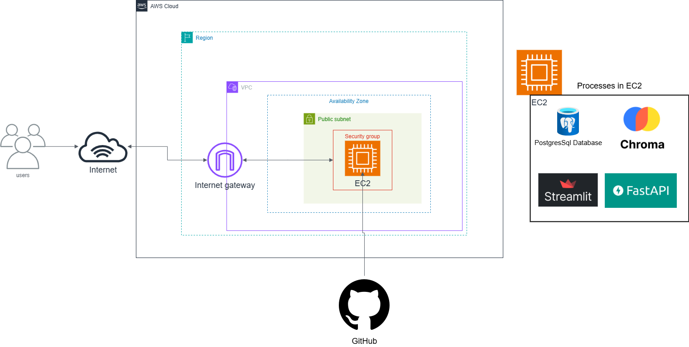

# AWS Terraform Infrastructure Project

This Terraform project creates a secure and scalable AWS infrastructure following AWS Well-Architected Framework principles.

## Architecture Overview

The infrastructure includes:
- **VPC** with public subnets across multiple AZs
- **Internet Gateway** for internet connectivity
- **Security Groups** with least privilege access
- **EC2 instance** (t2.large) running Ubuntu 22.04 LTS with monitoring and logging
- **Elastic IP** for static public IP address
- **VPC Flow Logs** for network monitoring
- **CloudWatch monitoring** and logging

### Architecture Diagram



The diagram above illustrates the complete AWS infrastructure architecture deployed by this Terraform project:

**Network Layer:**
- **VPC (Virtual Private Cloud)**: Provides isolated network environment with CIDR block 10.0.0.0/16
- **Public Subnets**: Distributed across multiple Availability Zones for high availability
- **Internet Gateway**: Enables internet connectivity for resources in public subnets
- **Route Tables**: Direct traffic between subnets and to the internet

**Compute Layer:**
- **EC2 Instance**: Ubuntu 22.04 LTS (t2.large) with pre-installed Miniconda3 and PostgreSQL 16
- **Elastic IP**: Provides static public IP address for consistent external access
- **Security Group**: Configured with minimal access (SSH port 22 and application port 8501)

**Application Stack:**
- **Miniconda3**: Python environment for data science and machine learning workloads
- **PostgreSQL 16**: Database server for data persistence and analytics
- **Custom Applications**: Ready to deploy on port 8501 for web-based interfaces

**Security & Monitoring:**
- **IAM Roles**: Least privilege access for EC2 instances
- **VPC Flow Logs**: Network traffic monitoring and security analysis
- **CloudWatch**: Comprehensive monitoring and logging for operational insights
- **EBS Encryption**: Encrypted storage volumes for data protection

This architecture follows AWS Well-Architected Framework principles, ensuring security, reliability, performance efficiency, cost optimization, and operational excellence.

## AWS Well-Architected Framework Implementation

### 1. Security Pillar
- ✅ VPC with private networking
- ✅ Security groups with minimal required access
- ✅ IAM roles with least privilege
- ✅ EBS encryption enabled
- ✅ VPC Flow Logs for network monitoring
- ✅ Systems Manager access for secure instance management

### 2. Reliability Pillar
- ✅ Multi-AZ subnet deployment
- ✅ EBS-optimized instances
- ✅ Automated recovery through user data scripts
- ✅ Health check endpoint

### 3. Performance Efficiency Pillar
- ✅ GP3 EBS volumes for better performance
- ✅ EBS-optimized instances
- ✅ Right-sized instance type (t2.large)

### 4. Cost Optimization Pillar
- ✅ GP3 volumes (cost-effective storage)
- ✅ Appropriate instance sizing
- ✅ Resource tagging for cost tracking

### 5. Operational Excellence Pillar
- ✅ Infrastructure as Code (Terraform)
- ✅ Modular architecture
- ✅ CloudWatch monitoring
- ✅ Automated deployment scripts

## Prerequisites

1. **AWS CLI configured** with appropriate credentials
2. **Terraform installed** (version >= 1.0)
3. **AWS Key Pair created** for EC2 access

### Create AWS Key Pair (if not exists)
```bash
aws ec2 create-key-pair --key-name my-key-pair --query 'KeyMaterial' --output text > ~/.ssh/my-key-pair.pem
chmod 400 ~/.ssh/my-key-pair.pem
```

## Quick Start

1. **Clone and navigate to the project directory**
   ```bash
   cd /home/ohammed/aws-terraform
   ```

2. **Copy and customize variables**
   ```bash
   cp terraform.tfvars.example terraform.tfvars
   # Edit terraform.tfvars with your values
   ```

3. **Initialize Terraform**
   ```bash
   terraform init
   ```

4. **Plan the deployment**
   ```bash
   terraform plan
   ```

5. **Apply the configuration**
   ```bash
   terraform apply
   ```

6. **Access your instance**
   ```bash
   # SSH access (Ubuntu uses 'ubuntu' user by default)
   ssh -i ~/.ssh/your-key-pair.pem ubuntu@<public-ip>
   
   # Web application
   curl http://<public-ip>:8501
   curl http://<public-ip>:8501/health
   ```

## Configuration

### Required Variables
- `key_pair_name`: Your AWS key pair name
- `aws_region`: AWS region for deployment

### Optional Variables
- `project_name`: Project name (default: "terraform-aws-project")
- `environment`: Environment name (default: "dev")
- `instance_type`: EC2 instance type (default: "t2.large")
- `vpc_cidr`: VPC CIDR block (default: "10.0.0.0/16")

## Module Structure

```
modules/
├── vpc/           # VPC, subnets, IGW, routing
├── security/      # Security groups
└── ec2/           # EC2 instances, IAM roles
```

## Security Considerations

1. **SSH Access**: Consider restricting SSH access to specific IP ranges
2. **Key Management**: Store private keys securely
3. **Regular Updates**: Keep AMIs and packages updated
4. **Monitoring**: Review CloudWatch logs and VPC Flow Logs regularly

## Monitoring and Logging

- **CloudWatch Metrics**: CPU, memory, disk usage
- **CloudWatch Logs**: System logs and application logs
- **VPC Flow Logs**: Network traffic monitoring
- **Health Check**: Available at `http://<public-ip>:8501/health`

## Cleanup

To destroy all resources:
```bash
terraform destroy
```

## Cost Estimation

Use the [AWS Pricing Calculator](https://calculator.aws) for detailed cost estimates based on your usage patterns.

## Support

For issues or questions:
1. Check AWS documentation
2. Review Terraform AWS provider documentation
3. Check CloudWatch logs for troubleshooting

## Next Steps

Consider implementing:
- Application Load Balancer for high availability
- Auto Scaling Groups for elasticity
- RDS database for data persistence
- CloudFront for content delivery
- Route 53 for DNS management
- AWS Backup for data protection
